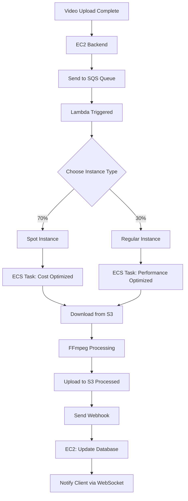

# Video Processing Job Flow: ECS & EC2 Architecture

## Overview

This document explains the complete video processing pipeline architecture, detailing how ECS containers and EC2 instances work together to process video uploads efficiently with cost optimization.

## Complete Processing Pipeline

### 1. Job Initiation (Backend EC2)

The video processing workflow begins when a video upload is completed on the backend EC2 instance:

```typescript
// videoService.ts:111-115
await sqsService.sendVideoProcessingMessage(
  config.S3_BUCKET_RAW,
  `videos/${videoId}/${video.filename}`,
  videoId
);
```

**Process:**
- Backend EC2 receives video upload completion event
- Sends processing message to SQS queue
- Updates video status to "PROCESSING"
- Emits WebSocket event to notify client

### 2. Lambda Trigger (Serverless Orchestrator)

Lambda function acts as the orchestrator, receiving SQS messages and launching ECS tasks:

```javascript
// lambda/dist/index.js:209-257
const handler = async (event, context) => {
  // Receives SQS messages
  // Determines Spot vs Regular Fargate (70% Spot, 30% Regular)
  // Launches ECS task with optimized settings
}
```

#### Cost Optimization Logic:
- **70% Spot instances** → 70% cost savings
- **30% Regular Fargate** → Reliability fallback
- Files >1GB automatically use Regular Fargate for reliability
- Automatic fallback if Spot capacity unavailable

### 3. ECS Task Execution (Container Processing)

#### Task Configuration:
```yaml
CPU: 2048 (2 vCPU)
Memory: 4096 MB (4 GB)
Network Mode: awsvpc
Compatibility: FARGATE
```

#### Environment Variables by Instance Type:
```javascript
// Spot Instance Settings (Cost Optimized)
FFMPEG_PRESET: "medium"
FFMPEG_THREADS: "1"
PROCESSING_PRIORITY: "low"
MAX_PROCESSING_TIME: "3600" // 1 hour
ENABLE_BATCH_MODE: "true"

// Regular Instance Settings (Performance Optimized)
FFMPEG_PRESET: "fast"
FFMPEG_THREADS: "2"
PROCESSING_PRIORITY: "normal"
MAX_PROCESSING_TIME: "1800" // 30 minutes
ENABLE_BATCH_MODE: "false"
```

### 4. Video Processing (Container)

The ECS container performs the actual video processing:

```typescript
// container/src/process-video.ts:534-608
public async process(): Promise<void> {
  // 1. Download video from S3 raw bucket
  await this.downloadVideo(inputPath);

  // 2. Process with FFmpeg (adaptive quality based on instance type)
  await this.processVideoWithFFmpeg(inputPath, outputPath);

  // 3. Upload processed files to S3 (DASH format)
  await this.uploadProcessedFiles(outputPath);

  // 4. Send webhook notification to backend
  await this.sendWebhook("ready", manifestUrl);
}
```

#### Processing Optimizations:

**Spot Instances (Cost Priority):**
- 3 quality levels: 720p, 480p, 360p
- Lower bitrates for faster processing
- CRF 25 (slightly lower quality)
- 6-second segments for efficiency

**Regular Instances (Quality Priority):**
- 4 quality levels: 1080p, 720p, 480p, 360p
- Higher bitrates for better quality
- CRF 23 (higher quality)
- 4-second segments for better streaming

#### Output Format:
- **DASH streaming format** with adaptive bitrates
- **HLS compatibility** for broad device support
- **CloudFront optimized** caching headers
- **Thumbnail generation** included

### 5. Webhook Completion (Back to EC2)

Once processing is complete, the container sends a webhook to the backend:

```typescript
// videoService.ts:249-298
async markVideoAsReady(videoId: string, manifestUrl: string) {
  // Update video status to "READY"
  // Build CloudFront URLs for streaming
  // Update database with manifest and video URLs
  // Emit WebSocket event to notify client
}
```

**CloudFront URL Generation:**
```typescript
const manifestUrl = `${cloudfrontBaseUrl}/${manifestPath}`;
const videoUrl = `${cloudfrontBaseUrl}/${videoId}/`;
const thumbnailUrl = `${cloudfrontBaseUrl}/${videoId}/thumbnail.jpg`;
```

## Architecture Benefits

### Cost Optimization
- **70% cost savings** using Spot instances
- **Intelligent fallback** to regular Fargate when needed
- **Adaptive processing settings** based on instance type
- **Efficient resource allocation** with auto-scaling

### Scalability
- **Auto-scaling ECS tasks** based on SQS queue depth
- **Parallel processing** of multiple videos
- **Horizontal scaling** across multiple availability zones
- **Stateless container design** for easy scaling

### Reliability
- **Health checks** every 30 seconds with 3 retries
- **Dead letter queues** for failed processing jobs
- **Processing timeouts** (30min for regular, 1hr for Spot)
- **Webhook notifications** for real-time status updates
- **Automatic retry logic** for transient failures

### Security
- **Private subnets** for ECS tasks
- **VPC isolation** for all compute resources
- **IAM roles** with least privilege access
- **Encrypted storage** for all S3 buckets

## Processing Flow Summary



### Step-by-Step Flow:
1. **EC2 Backend** receives upload completion → sends message to SQS
2. **Lambda Function** processes SQS message → determines Spot vs Regular Fargate
3. **ECS Container** downloads video → processes with optimized FFmpeg settings
4. **Processed Files** uploaded to S3 → CloudFront URLs generated
5. **Webhook** notifies EC2 backend → database updated with streaming URLs
6. **WebSocket** notifies client → video ready for streaming

## Configuration Files

### Key Infrastructure Components:
- `IaC/src/compute/ecs.ts` - ECS cluster and task definition
- `IaC/src/compute/lambda.ts` - Lambda trigger function
- `IaC/src/messaging/sqs.ts` - SQS queue configuration
- `container/src/process-video.ts` - Video processing logic
- `server/src/services/videoService.ts` - Backend orchestration

This architecture efficiently handles video processing with significant cost savings while maintaining high reliability and scalability for production workloads.